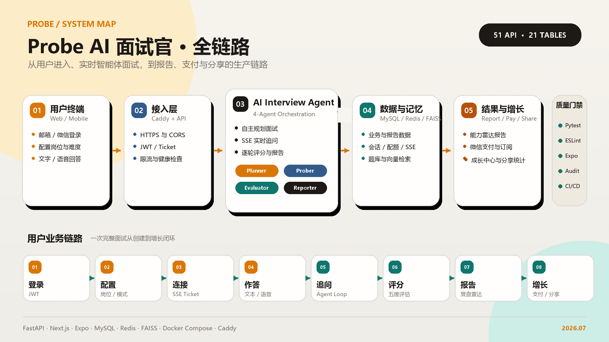

# Probe — AI 面试官智能体平台

> 一个会思考、有记忆、懂面试的 AI 面试官。

中文流式追问面试训练平台。Agent 自主规划面试流程、调度记忆系统、检索知识库，模拟真实面试官的思考过程。不是简单的 ChatBot 问答，是完整的智能体架构。

## 核心特性

- **流式追问** — AI 面试官实时追着你的回答漏洞往下挖，模拟真实面试压力
- **四种模式** — 技术面 / 行为面 / 情景面 / 压力面，覆盖所有面试场景
- **实时评分** — 每道题即时打分，五维雷达图深度报告
- **记忆系统** — 跨面试能力追踪，越练越懂你的薄弱点
- **语音面试** — App 端支持语音输入 + AI 语音播报 (Whisper + Edge TTS)
- **分享裂变** — 面试成绩单一键生成分享图
- **候选人证据库** — 简历解析、STAR 故事质量检查与题目匹配推荐
- **复练闭环** — 逐题立即重答、证据化评分、原回答/重答对比和多版本答案优化
- **多模态表达训练** — Web/App 录像、语速/停顿/填充词/重复表达和基础目光指标
- **专项训练室** — 3–8 分钟弱项快练、真人教练、组织 Rubric/题库和技术面工具

## 市场定位

Final Round AI 的体验 × 中文市场 × 非技术岗 × 微信生态裂变

| 差异化 | 说明 |
|--------|------|
| 中文流式追问 | 国内零竞品，牛客的 AI 面试是走形式 |
| 非技术岗覆盖 | 产品/运营/市场/销售/管理，不只是程序员 |
| 成绩单裂变 | 分享图到朋友圈/小红书，竞品都没做 |

## 技术栈

| 层 | 选型 |
|---|---|
| 后端 | Python 3.12 + FastAPI + SQLAlchemy 2.0 (async) |
| 智能体 | 自研 Agent Loop — 4 子智能体 (Planner/Prober/Evaluator/Reporter) |
| LLM | MiMo (小米) — OpenAI 兼容接口 |
| 知识检索 | FAISS 向量检索 + MySQL 词法兜底 + 可配置 Embedding |
| 数据库 | MySQL 8.0 + Redis 7 |
| 前端 Web | Next.js 16 + TypeScript + Tailwind CSS |
| 前端 App | Expo 56 + React Native + NativeWind |
| 部署 | Docker Compose + Caddy + GitHub Actions CI/CD |

## 项目规模

```
代码量:    18,000+ 行 (Python + TypeScript)
后端:      90+ 个源文件, 134 个 API 方法/健康端点, 23 个路由模块
Web 前端:  17 个页面, 20+ 个组件
App:       18 个页面, 7 个组件
数据库:    32 张 MySQL 表 + Redis 缓存 + 可选 FAISS 向量索引
文档:      完整架构设计 + API 规范 + 任务清单
```

## 系统架构



> 详细链路、时序、支付/分享流程与发布验收见 [端到端功能链路](doc/implementation/END_TO_END_CHAIN.md)。


```
┌─────────────────────────────────────────────────┐
│           客户端 (Web / App / 小程序)             │
└────────────────────────┬────────────────────────┘
                         │
┌────────────────────────▼────────────────────────┐
│              API 网关 (Caddy)                     │
└────────────────────────┬────────────────────────┘
                         │
┌────────────────────────▼────────────────────────┐
│           FastAPI 应用服务层                       │
│                                                   │
│  ┌─────────────────────────────────────────┐    │
│  │         面试官 Agent (主控)               │    │
│  │  Planner → Prober → Evaluator → Reporter│    │
│  └─────────────────────────────────────────┘    │
│                                                   │
│  Auth │ Interview │ Config │ Payment │ Speech    │
└────────────────────────┬────────────────────────┘
                         │
┌────────────────────────▼────────────────────────┐
│  MySQL (结构化) │ Redis (状态/缓存) │ FAISS (向量) │
└─────────────────────────────────────────────────┘
```

## 项目结构

```
Probe/
├── backend/              # Python FastAPI 后端
│   ├── agent/            # 智能体核心 (planner/prober/evaluator/reporter)
│   ├── api/              # 23 个路由模块, 134 个 API 方法/健康端点
│   ├── models/           # SQLAlchemy ORM (32 表)
│   ├── services/         # LLM / 语音 / 推送
│   ├── knowledge/        # FAISS 向量检索 + embedding
│   ├── memory/           # Redis 工作记忆
│   └── BACKEND.md        # 完整后端接口文档
├── web/                  # Next.js 16 前端
│   ├── app/              # 17 个页面 (含训练室/面试/报告/历史/隐私/微信回调等)
│   ├── components/       # 20+ 个 UI 组件
│   └── lib/              # API/SSE/Auth 封装
├── mobile/               # Expo React Native App
│   ├── app/              # 18 个页面 (含训练室、录像和语音面试)
│   ├── components/       # 7 个原生组件 (雷达图/录音/播放)
│   └── lib/              # API/SSE/Auth/Audio
├── doc/                  # 架构文档
│   ├── architecture/     # 系统设计 + 数据库 + Prompt
│   ├── implementation/   # 部署 + 任务清单
│   └── business/         # 竞品分析 + 市场定位
├── .claude/skills/       # 20 个 AI 开发辅助 skill
├── .github/workflows/    # CI (语法检查+构建) + CD (自动部署)
├── docker-compose.yml    # 生产部署 (Caddy+Backend+Web+MySQL+Redis)
└── docker-compose.dev.yml # 开发环境 (热重载)
```

## 本地开发

```bash
# 克隆
git clone https://github.com/3163635853-rgb/Probe.git
cd Probe

# 环境变量
cp .env.example .env
# 编辑 .env 填入 API Key 等配置

# 启动后端 + 数据库 (开发模式)
docker compose -f docker-compose.dev.yml up

# 数据库初始化
docker compose exec backend alembic upgrade head
docker compose exec backend python -m db.seed
docker compose exec backend python scripts/import_questions.py

# 访问
# 后端 API: http://localhost:8000
# Web 前端: http://localhost:3000
# API 文档: http://localhost:8000/docs
```

### Mobile 开发

```bash
cd mobile
npm install
npx expo start
# 用 Expo Go 扫码在手机上运行
```

## 文档

| 文档 | 内容 |
|------|------|
| [后端接口文档](backend/BACKEND.md) | 52 个端点完整规范 (请求/响应/错误码) |
| [系统架构](doc/architecture/ARCHITECTURE.md) | Agent 状态机、技术决策、数据流 |
| [数据库设计](doc/architecture/DATABASE.md) | 21 表 ORM + Redis Key + FAISS |
| [App API](doc/architecture/API_APP.md) | App 独有接口 + 差异说明 |
| [竞品分析](doc/business/COMPETITIVE.md) | 市场调研 + 定价策略 |
| [App 开发计划](doc/implementation/PHASE2_APP.md) | Expo 3 周任务清单 |
| [上线检查清单](doc/implementation/PRODUCTION_READINESS.md) | 支付商户材料、部署步骤与生产验证 |
| [端到端功能链路](doc/implementation/END_TO_END_CHAIN.md) | 全功能链路、时序图、验收结果与发布配置 |
| [高级训练系统](doc/implementation/ADVANCED_TRAINING.md) | 简历、复练、视频、教练、企业和技术面能力说明 |

## 版本规划

| Phase | 内容 | 状态 |
|-------|------|------|
| 1 | Web + 后端 + Agent 核心 + 知识库 | ✅ 完成 |
| 2 | React Native App + 语音面试 | ✅ 完成 |
| 3 | 微信小程序 | 待开发（支付已在 Web/App 完成） |
| 4 | 企业训练空间 + 教练 + 技术面工具 | ✅ 完成（SSO/保留策略配置需部署方接入身份源） |

## 质量保障

- 5 轮自动化代码审计，修复 30 个问题
- 全局异常处理 (不泄露堆栈)
- SSE 断线自动重连 + iOS 后台恢复
- 配额原子扣减 (Redis Lua 脚本)
- DB 提交失败补偿回滚
- CI: 后端测试与迁移 + Web lint/build + Mobile typecheck/lint + Compose 校验
- CD: 迁移优先、健康检查等待、失败日志与自动停止
- 微信支付 API v3: JSAPI/H5 下单、RSA 验签、AES-GCM 回调解密、幂等履约
- 分享图片: 服务端生成、持久化、渠道记录与点击统计
- 自动化测试: 33 项后端测试，覆盖支付、分享、成长、长期画像、通知、知识库兜底和路由契约

## 独立开发

从产品设计、架构设计、数据库建模，到 Agent 开发、前端实现、App 开发、部署运维——全部独立完成。

不是用模板拼凑的 demo，是可以服务真实用户的生产级系统。

## License

Private — All rights reserved.
