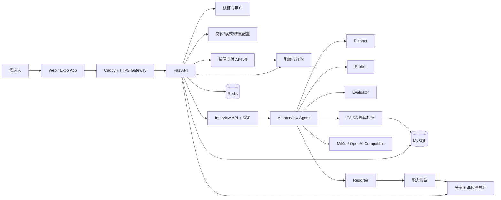
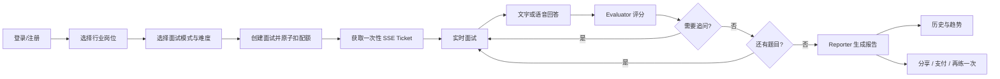
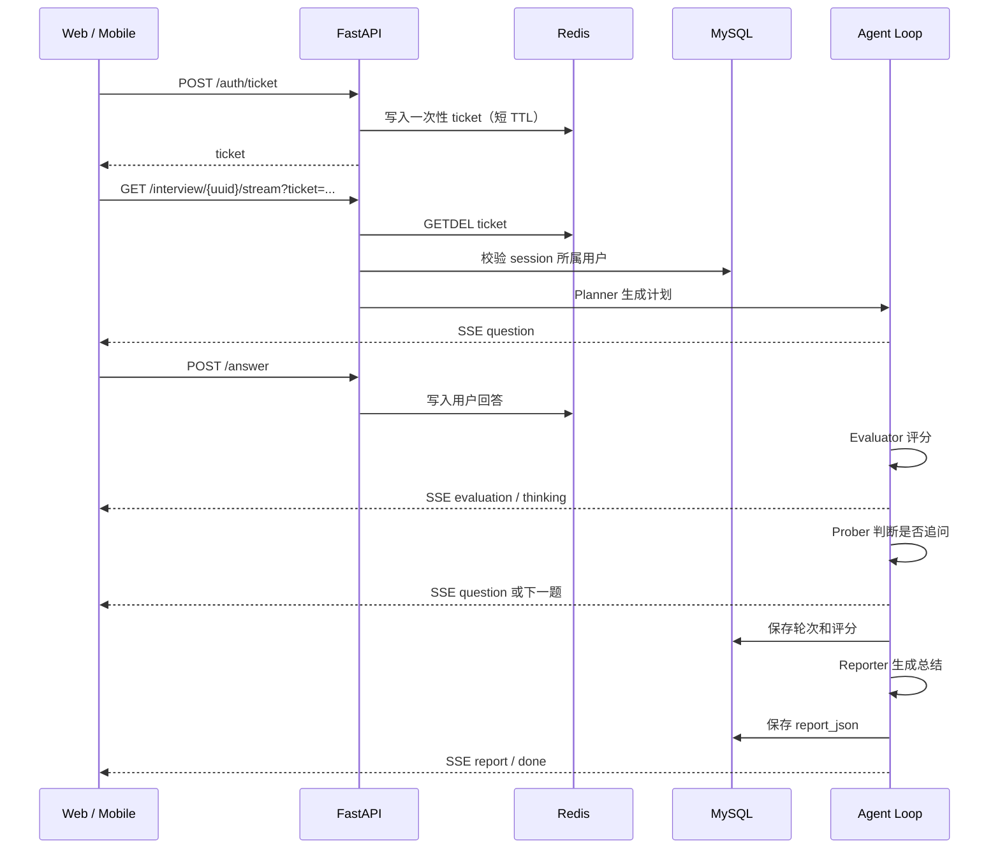
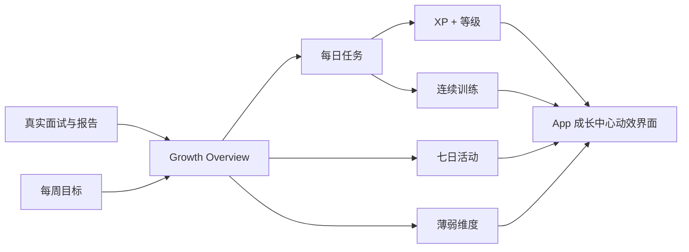
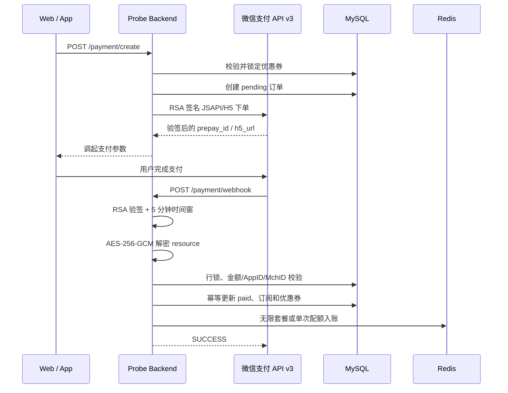
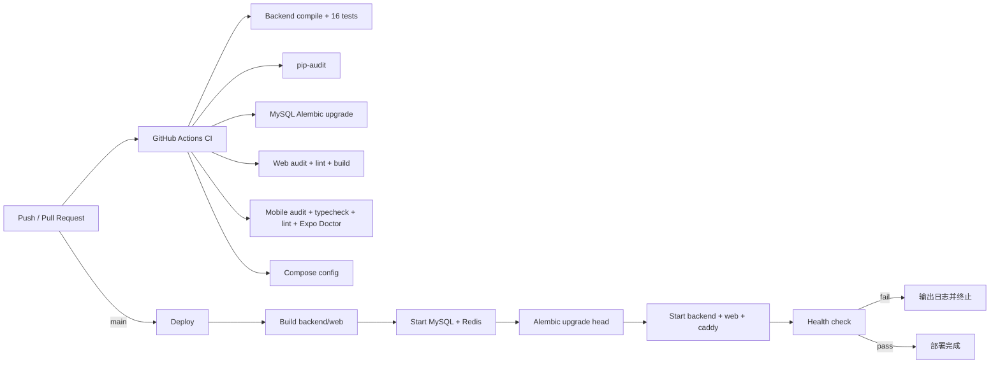

# Probe AI 面试官：端到端功能链路与发布验收

> 版本日期：2026-07-16
>
> 分支：`main`
>
> 规模：51 个 API/健康路由、21 张业务表、Web + Expo App 双端


## 1. 当前结论

本轮对认证、配置、配额、实时面试、Agent、语音、报告、支付、订阅、优惠券、邀请、通知、分享、文件上传、CI/CD 和部署配置进行了重新复检。

| 区域 | 结果 | 说明 |
|---|---|---|
| Backend compile | PASS | 全部 Python 文件可编译，FastAPI 可导入 |
| Backend tests | PASS | 20 个测试通过 |
| API contract | PASS | 51 条路由的方法与路径完整匹配 |
| ORM metadata | PASS | 21 张业务表全部注册 |
| Alembic | PASS | Head 为 `7c2d9b4f8a11`，完整 MySQL 离线 SQL 可生成 |
| Python audit | PASS | `pip-audit` 无已知漏洞 |
| Web | PASS | ESLint 零错误、Next.js 生产构建成功、npm audit 为 0 |
| Mobile | PASS | TypeScript、ESLint、Expo Doctor 21/21、npm audit 为 0 |
| Caddy | PASS | 配置验证通过，兼容新旧 App API 前缀 |
| Compose | PASS | 生产和开发 Compose 静态校验通过 |
| Docker 本机实跑 | ENV BLOCKED | Windows WSL 商店组件为 `NeedsRemediation`，不是仓库配置错误 |
| 微信支付实单 | CREDENTIAL REQUIRED | 代码链路完成，需要商户私钥、公钥、API v3 Key 和商户平台配置 |
| LLM/语音真机调用 | PROVIDER REQUIRED | 需要有效 MiMo/OpenAI 兼容服务凭证 |

## 2. URL 与入口约定

| 客户端 | API Base URL | 调用示例 |
|---|---|---|
| Web 生产 | `https://api.probe.app/api` | `/auth/login` → `https://api.probe.app/api/auth/login` |
| Web 开发 | `http://localhost:8000/api` | `/interview/start` |
| Mobile 生产 | `https://api.probe.app/api` | `/config/app-version` |
| Mobile 开发 | 通过 `EXPO_PUBLIC_API_URL` 配置 | 推荐局域网可达的 `http://IP:8000/api` |

所有 Web/Mobile 调用点都只写 `/auth/login` 这种相对业务路径，由各自 `BASE_URL` 统一补 `/api`。

Caddy 同时保留旧版 App 兼容：旧客户端访问 `/auth/login` 时会自动重写到 `/api/auth/login`。

## 3. 总体系统链路



## 4. 用户主链路



## 5. 认证链路

### 邮箱登录

1. Web/Mobile 调用 `POST /api/auth/register` 或 `POST /api/auth/login`。
2. 后端校验邮箱和 bcrypt 密码哈希。
3. PyJWT 使用 HS256 签发 Token。
4. Web 将 Token 保存在 `localStorage`；Mobile 保存在 `expo-secure-store`。
5. 每次 API 调用携带 `Authorization: Bearer <token>`。
6. Token 临近过期时，后端通过 `X-New-Token` 自动续签。
7. 客户端收到 401 后清理本地 Token 并返回登录页。

### 微信登录

1. Web 获取微信开放平台 OAuth code。
2. `POST /api/auth/wechat` 用 code 换取 openid。
3. 后端查找或创建用户并签发 JWT。
4. 微信支付 JSAPI 复用同一 AppID 下的用户 openid。

开发模式的微信 mock 只在 `DEBUG=true` 且未配置 AppID 时启用，生产环境不会进入 mock。

## 6. 面试创建与配额链路

1. 客户端加载：
   - `GET /api/config/industries`
   - `GET /api/config/positions`
   - `GET /api/config/modes`
   - `GET /api/config/difficulties`
   - `GET /api/quota/status`
   - `GET /api/interview/active`
2. 用户提交 `POST /api/interview/start`。
3. Redis Lua 脚本原子扣减当月配额，避免并发超用。
4. MySQL 创建 `interview_sessions`。
5. Redis 写入活跃会话、Agent 上下文和工作记忆。
6. 返回 `session_uuid`，客户端进入实时面试页。

套餐规则：

- 免费用户：按月配额。
- 月卡/年卡：无限面试。
- 单次购买：成功回调后向当前月配额增加 1 次。

## 7. SSE 与 Agent Loop



认证优先级：

1. 一次性 ticket。
2. `Authorization: Bearer` Header，供 App 回退。
3. query token，仅用于旧客户端兼容。

断线恢复：

- 每条 SSE 事件带递增 ID。
- Redis 保存 SSE 日志。
- Web 使用浏览器 `Last-Event-ID` 自动恢复。
- App 保存最后事件 ID 并执行指数退避重连。
- iOS 从后台回前台时主动重建连接。

## 8. 语音链路

### 语音输入

1. Web 使用 `MediaRecorder`；Mobile 使用 `expo-audio`。
2. 客户端请求麦克风权限并录制 WebM/M4A。
3. `POST /api/speech/transcribe` 上传 FormData。
4. 后端调用 OpenAI 兼容语音识别接口。
5. 返回文本后自动填充或发送回答。

### AI 语音播放

1. 客户端请求 `GET /api/speech/tts?text=...`。
2. 后端通过 Edge TTS 生成 MP3。
3. Web 使用 HTML Audio；Mobile 使用 `expo-audio` 播放。
4. 组件卸载、播放结束或重新播放时释放音频资源。

## 9. 报告、历史和成就链路

Reporter 生成：

- 综合评分。
- 五维能力分数。
- 优势与改进建议。
- 总体评价。
- 每题问题、回答、评分和点评。

数据写入 `interview_sessions.report_json`，客户端通过：

- `GET /api/interview/{uuid}/report`
- `GET /api/interview/history`
- `GET /api/interview/stats`

展示报告、历史和趋势图。完成面试后成就模块可读取并展示已达成状态。

## 10. 成长中心链路

App 1.1.0 新增底部 Tab「成长」，全部视觉元素使用 `lucide-react-native`、Moti、SVG、渐变和原生 View，不使用 AI 生成 UI 图标。

1. `GET /api/growth/overview` 读取或创建成长档案。
2. 后端汇总最近七天真实面试次数和均分。
3. 最近八份报告的能力维度被归一化为 0-100，自动识别优先突破项。
4. 每天生成面试、复盘和薄弱项专项三类任务。
5. 当天完成面试后，面试任务自动完成并发放 XP。
6. 手动任务通过 `POST /api/growth/tasks/{id}/complete` 完成。
7. XP 每 500 点提升一级；任务完成会更新连续训练天数和历史最长纪录。
8. `PUT /api/growth/weekly-goal` 设置每周 1-14 次训练目标。
9. App 使用等级光环、进度条、训练脉冲柱状图、任务完成弹性动画和触觉反馈展示状态。



## 11. 微信支付链路



支付支持：

- 微信内 Web：JSAPI。
- 手机浏览器和 Expo App：H5。
- 优惠券百分比折扣。
- 失败自动释放优惠券。
- 回调幂等。
- Redis 履约失败后由微信重试回调继续完成。

`auto_renew` 当前表示续费提醒偏好，不会在未取得微信委托扣款授权时自动扣款。

## 12. 分享增长链路

1. 报告页调用 `POST /api/share/generate-image`。
2. 后端验证报告归属和完成状态。
3. Pillow 生成 1080×1440 PNG，包含总分、能力雷达图和二维码。
4. 文件写入 `SHARE_STORAGE_DIR` 持久卷。
5. MySQL 创建 `share_records`。
6. Web 下载 Blob；App 调用系统分享面板。
7. `POST /api/share/record` 记录渠道和分享次数。
8. 二维码进入 `GET /api/share/callback/{id}`，原子增加点击次数并跳转站点。

Web 在服务端图片生成失败时保留 html2canvas 降级路径。

## 13. 头像与文件链路

1. 用户上传头像到 `POST /api/file/upload?type=avatar`。
2. 后端校验扩展名和 5 MB 大小限制。
3. 文件写入 `UPLOAD_STORAGE_DIR` 持久卷。
4. 返回 `PUBLIC_API_URL/api/file/{uuid}` 完整 URL。
5. 头像 UUID 资源允许公开读取并使用一年不可变缓存。
6. `audio_input` 文件仍要求 Bearer Token，返回 `private, no-store`。

这避免了生产环境中相对 URL 指向 Web 域名导致头像 404，也避免容器重建丢失上传文件。

## 14. 邀请、优惠券和通知链路

### 邀请

- 获取邀请码：`GET /api/invite/my-code`
- 兑换邀请码：`POST /api/invite/redeem`
- 邀请记录：`GET /api/invite/records`
- Redis Lua 原子发放邀请配额，数据库唯一约束防重复兑换。

### 优惠券

- 兑换：`POST /api/coupon/redeem`
- 查看：`GET /api/coupon/mine`
- Web 和 App 购买套餐时可选择折扣券。
- 创建订单时锁券，支付失败释放，支付成功核销。

### 通知

- 列表、未读数、单条已读、全部已读完整接入。
- App 启动时上报 push token 和设备平台。
- Web 顶部铃铛展示未读 badge。

## 15. 数据层

### MySQL：21 张业务表

用户、配置、面试会话、面试轮次、知识题库、支付、订阅、邀请、通知、优惠券、成就、反馈和分享记录。

### Redis

主要承担：

- 月度配额。
- 活跃面试锁。
- 一次性 SSE ticket。
- Agent 工作记忆。
- 回答队列和 SSE 事件日志。
- 邀请奖励原子计数。

### FAISS

用于题库 embedding 和相似问题检索，向 Planner/Prober 提供岗位和能力维度相关问题。

## 16. API 路由清单

| 模块 | 数量 | 路由范围 |
|---|---:|---|
| Auth | 6 | `/api/auth/*` |
| Config | 5 | `/api/config/*` |
| Quota | 1 | `/api/quota/status` |
| Interview + SSE | 9 | `/api/interview/*` |
| Feedback | 1 | `/api/feedback` |
| Payment | 4 | `/api/payment/*` |
| Subscription | 2 | `/api/subscription/*` |
| Speech | 2 | `/api/speech/*` |
| Invite | 3 | `/api/invite/*` |
| Notification | 4 | `/api/notification/*` |
| Coupon | 2 | `/api/coupon/*` |
| Achievement | 1 | `/api/achievement/list` |
| Share | 4 | `/api/share/*` |
| File | 2 | `/api/file/*` |
| User device | 1 | `/api/user/push-token` |
| Growth | 3 | `/api/growth/*` |
| Health | 1 | `/health` |
| **合计** | **51** | |

## 17. CI/CD 链路



Deploy 工作流会先检查 `SERVER_IP`、`SERVER_USER` 和 `SSH_KEY`。未配置时明确记录 notice 并安全跳过，避免把代码发布错误与仓库基础设施未配置混为一谈。

## 18. 发布所需秘密配置

生产 `.env` 必须配置：

```env
JWT_SECRET=<至少32字节>
DEEPSEEK_API_KEY=<provider-key>
WX_APP_ID=<wechat-app-id>
WX_APP_SECRET=<wechat-app-secret>
WECHAT_PAY_MCH_ID=<merchant-id>
WECHAT_PAY_MCH_SERIAL_NO=<merchant-serial>
WECHAT_PAY_PUBLIC_KEY_ID=<public-key-id>
WECHAT_PAY_API_V3_KEY=<32-byte-api-v3-key>
WECHAT_PAY_NOTIFY_URL=https://api.probe.app/api/payment/webhook
PUBLIC_API_URL=https://api.probe.app
PUBLIC_WEB_URL=https://probe.app
```

服务器秘密文件：

```text
secrets/wechat/apiclient_key.pem
secrets/wechat/wechatpay_public_key.pem
```

秘密目录、`.env`、上传文件和分享图片都已排除在 Git 跟踪之外。

## 19. 本轮复检命令

```bash
# Backend
cd backend
uv run python -m compileall -q -x "\\.venv" .
uv run pytest -q
uv run pip-audit
uv run alembic upgrade head --sql

# Web
cd web
npm audit --omit=dev --audit-level=moderate
npm run lint
npm run build

# Mobile
cd mobile
npm audit --omit=dev --audit-level=moderate
npm run check
npm run bundle:check

# Infrastructure
caddy validate --config Caddyfile --adapter caddyfile
docker compose config --quiet
docker compose -f docker-compose.dev.yml config --quiet
git diff --check
```

## 20. 运行环境说明

本机 Docker Desktop Linux Engine 因 Windows Store WSL 组件状态为 `Modified, NeedsRemediation` 而无法启动。Caddy、Compose、迁移 SQL、代码、测试和构建均已验证；Linux 容器实跑需要先修复本机 WSL 或由 GitHub Actions/生产服务器完成。

这项阻塞属于当前 Windows 主机环境，不属于 Probe 仓库代码缺陷。
